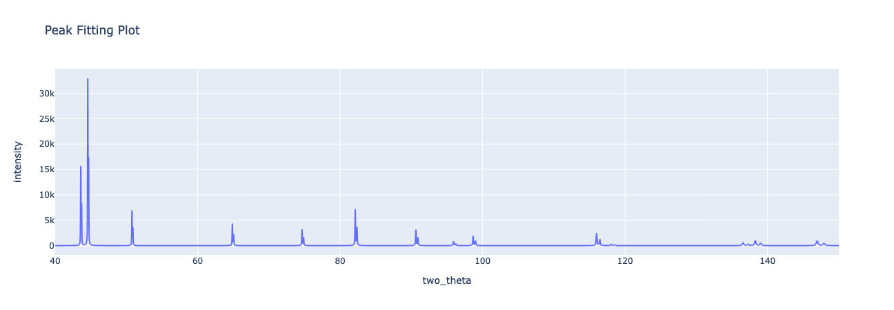
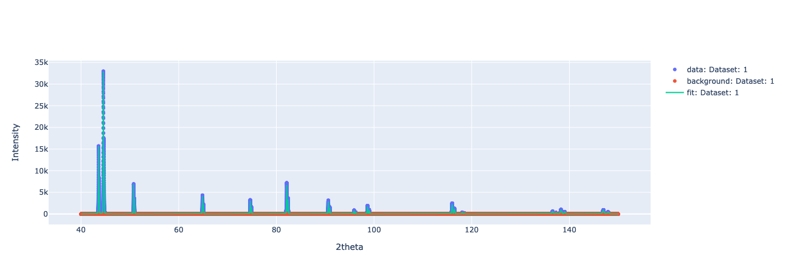
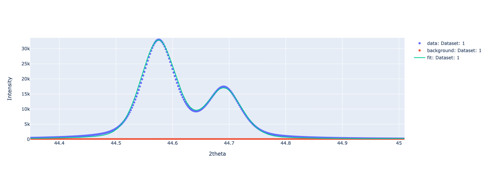
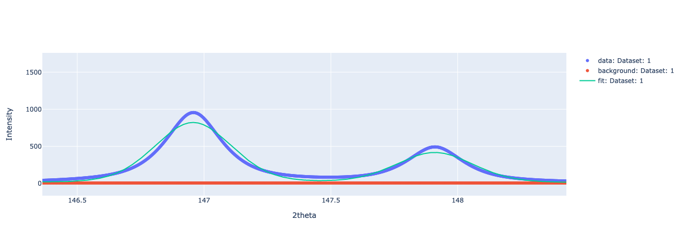

Example 01A
#########################

*************************
Background
*************************

Simulated diffraction data, using GSAS-II default Cu K alpha parameters.
Well controlled example data

*************************
File Description
*************************
.. VERY rigid structure.  "|" and  "+" must all be in the same column position for ALL rows

+---------+-------------------------------------+
|    Type |                            Filename |
+=========+=====================================+
|DataFile |        Example01A_generator_edit.csv|
+---------+-------------------------------------+
| CIF File|                austenite-FeOnly.cif |
+---------+-------------------------------------+
| CIF File|                  ferrite-FeOnly.cif |
+---------+-------------------------------------+
|InstParam|                    CuDefault.instprm|
+---------+-------------------------------------+

Data generated by Adam Creuziger, using GSAS-II.  Histogram scale of 1000, high signal to noise.
Phase fraction of 0.25 austenite, 0.75 ferrite were input to the simulation.
Range of 40° to 150° at 0.002° step size.  Small step size means analysis might take a minute or two.

*************************
Expected Output
*************************

=========================
Intensity Plots
=========================
The raw data and fitted intensity plots should look like the following:

   
Using the "Zoom" tool in the raw and fitted image, it's possible to get additional details of the peak fitting.
The most intense peak is the ferrite (110) reflection, which is well fit.

The peak with the highest 2-theta value is the austenite (420) reflection.
The fit quality is not ideal here, the peak shape is not well captured.

=========================
Normalized Itensities
=========================

**Add when the tables are revised**

Phase fractions of 0.25 austenite, 0.75 ferrite.

.. automodule:: user_guide
    :members:
